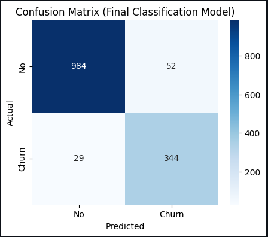

# Customer Churn Prediction & Retention Strategy
This project builds an end-to-end Customer Churn Prediction System using Machine Learning (LightGBM) combined with a Business Decision Layer to help companies not only identify which customers are at risk, but also determine:
- Who should be prioritized for retention
- How much maximum incentive should be offered
- Expected financial loss if the customer churns
- Personalized retention strategies based on customer behavior

The final system is deployed as an interactive Streamlit application where users can input customer attributes and receive both the churn prediction and the recommended business action.
---
## Key Features
### Machine Learning Model
- Algorithm: LightGBM
- Classification Report:
  
                       precision    recall  f1-score   support
        
                   0       0.97      0.95      0.96      1036
                   1       0.87      0.92      0.89       373

            accuracy                           0.94      1409
           macro avg       0.92      0.94      0.93      1409
        weighted avg       0.94      0.94      0.94      1409
        AUC-ROC: 0.9890936992143426
### Confusion Matrix:  
   

*Keytakeaways:* LGBM model is highly effective for churn prediction.
- Achieved ≥ 90% recall for churn, ensuring that almost all at-risk customers are successfully identified.
- Highly suitable as a strategic foundation for customer retention interventions, including:
   - targeted discounts,
   - service upgrades,
   - outbound engagement calls,
   - personalized promotional offers.
### Retention Strategy Logic
Each customer goes through the following calculations:

    CLTV = monthly charges * tenure
    Expected Loss = probabilit of churn × CLTV
    Retention Efficiency Rate = 0.7 → every $1 spent prevents $0.70 of expected loss
    Max Marketing Offer = Expected Loss × 0.7

This ensures retention budget is spent efficiently.
### Streamlit Deployment
The Streamlit app provides:

- Customer churn prediction
- Probability score
- Business impact evaluation
- Actionable retention recommendation
---
## Model Insights
| Top Factor           | Insight                                       | Business Impact                              |
| -------------------- | --------------------------------------------- | -------------------------------------------- |
| Satisfaction Score   | Low satisfaction → 3× more likely to churn    | Build Satisfaction Recovery Program          |
| Online Security      | Lack of security → highly correlated to churn | Offer free trial or upsell                   |
| Monthly Contract     | 2.17× more likely to churn                    | Promote annual contract upgrade              |
| High Monthly Charges | Higher fees drive churn                       | Provide flexible billing or tiered discounts |
| More Dependents      | Less likely to churn                          | Push family bundles                          |
---
## Explore The Project App

Click Streamlit app here:

👉 [Live Demo](https://telecom-customer-churn-prediction-retention-strategy.streamlit.app/)
